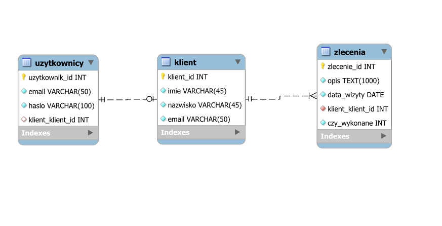

# APLIKACAJ INTERNETOWA SERWISU KOMPUTEROWEGO

# Założenia oraz przeznaczenie  projektu

Założeniem projektowym było stworzenie aplikacji internetowej na potrzeby serwisu sprzętu elektronicznego specjalizującego się w dziedzinie komputerów osobistych i laptopów\. Utworzenie aplikacji miało na celu ułatwienie kontaktu klientów z serwisem poprzez możliwość składania zamówień drogą Internetową\. Ponadto aplikacja ta służy jako reklama serwisu i okazja do poznania oferty serwisu przez potencjalnych partnerów biznesowych\. Aplikacja jest witryną internetową składającą się ze stron prezentujących różne informacje o serwisie\, zawierających ofertę serwisu wraz z możliwością sporządzenia przykładowego zlecenia\, umówienia się na wizytę\. Projekt witryny zakłada również umożliwienie kontaktu z serwisem jak również założenie konta użytkownika\, do którego przypisywane będą usługi\.

Wygląd witryny został zdefiniowany przy użyciu technologii HTML oraz CSS\. Za funkcjonalność części wizualnej odpowiada jeżyk JavaScript\. Został on użyty w celu animowania przycisków\, wyświetlania komunikatów itp\. Na potrzeby aplikacji utworzona została baza danych MySQL\, która przechowuje dane klientów\, użytkowników aplikacji oraz informacje dotyczące umówionych wizyt\. Za komunikację i użytkowanie bazy danych z poziomu aplikacji odpowiada PHP\. Język ten jest głównym językiem\, w którym powstała aplikacja\. Projekt został wykonany w środowisku Visual StudioCode\. Aplikacja jest uruchamiana za pomocąXAMPP’a\.

# Funkcjonalność aplikacji

Aplikacja jest uruchamiana poprzezlocalhostw przeglądarce Internetowej\. W folderzephpznajdują się pliki ze kodem strony\. Automatycznie uruchamia się plikindex\.php\, który jest głównym plikiem witryny – strona główną\. Pozostałe pliki są również plikami witryny bądź zawierają tylko skryptphp\, który odpowiada za wykonanie odpowiedniej akcji na serwerze WWW\. W głównym folderze znajduje się również plik script\.js\. Zawarta jest tam większość funkcji w języku JavaScript\, które umożliwiają odpowiednią funkcjonalność witryny\. W folderzecssznajdują się pliku\, nadające styl elementom witryny\. W plikach tych zawarte jest formatowanie odpowiednich sekcji dokumentów jak również zdefiniowane jest formatowanie pod kątemresponsywności– aplikacja jest dostosowana do działania na przeglądarkach zainstalowanych na urządzeniach mobilnych\.

# Funkcjonalność aplikacji – cd.

Aplikacja łączy się z bazą danych o nazwie „jtd”\, która znajduje się na serwerze MySQL\, również wXAMPP’ie\. Ze względu na uruchamianie aplikacji z lokalnego poziomu\, łączenie odbywa się poprzez kontorootbez hasła\. Z racji\, że strona działa tylko lokalnie nie zagraża to bezpieczeństwu\, gdyż tylko odpowiednie osoby mogą mieć dostęp do aplikacji i bazy danych\. Użytkownik może utworzyć konto w aplikacji\, w wyniku czego odpowiednie dane zostaną zapisane w bazie danych\, dokładnie w tabelachuzytkownicyi klient\. Po dodaniu wizyty rekord z danymi \- powiązany z tabelą klient \- pojawia się w tabeli zlecenia\. Hasło użytkownika jest szyfrowane w celach bezpieczeństwa\. Adres email będący loginem użytkownika\, ale również podczas umawiania wizyty bez konta jestsanityzowanyi weryfikowany za pomocą odpowiednich funkcji językaphp\. Tabele w bazie powiązane są odpowiednimi relacjami\.

Użytkownik może w aplikacji założyć konto\, zalogować się na swoje konto użytkownika i przeglądać umówione wizyty\. Nie posiadając konta użytkownika również można dodać jak i przeglądać wizyty\. Podczas dodawania wizyty można odblokować pole do podania hasła i założyć konto użytkownika\. Witryna oferuje również formularz kontaktowy\, który umożliwia wysyłanie wiadomości e\-mail do  serwisu\. E\-maile z potwierdzeniem są wysyłane także podczas dodawania wizyty jak i tworzenia konta użytkownika\. Umożliwienie wysyłania wiadomości e\-mail zlocalhost’awymagało zmian w pliku „php\.ini” oraz „sendmail\.ini”\. Jeśli użytkownik jest zalogowany automatycznie pokazywane są jego wizyty oraz uzupełnianie odpowiednie pola podczas dodawania wizyty w serwisie\. Jeśli użytkownik nie jest zalogowany podaje adres e\-mail\, na który została umówiona wizyty w celu sprawdzenia jej statusu\. W bazie danych dostępna jest procedura umożliwiająca zmianę statusu zlecenia na wykonane\.

# Narzędzia programowe

Cała witryna została napisana w środowisku Visual StudioCode\. Wykorzystane technologie to: HTML\, CSS\, JS\, PHP\, bibliotek do JS \-jQuery\. Aplikacja jest uruchamiana na lokalnym serwerze WWW\, wbudowanym w środowisko XAMPP\. Baza danych działa dzięki serwerowi MySQL również dostarczanemu przezXAMPP’a\. Zmiana odpowiednich ustawieńXAMPP’aumożliwiła również wysyłanie wiadomości e\-mail mimo\, że aplikacja uruchomiona jest nalocalhost\. BibliotekajQueryzostała wykorzystana do zastosowania mechanizmu płynnego przesuwania do określonych bloków na stronie\. Pozostałe funkcje JS zostały napisane w „czystym” JavaScript\. W PHP zostały wykorzystane funkcje odpowiadające za weryfikację i sanityzację adresu e\-mail oraz szyfrowanie i weryfikację haseł\.

# Obsługa e-maili na localhost

W celu umożliwienia wysyłania wiadomości e\-mail z localhostw pliku php\.ini należy wprowadzić następujące wartości\. Adres e\-mail został stworzony na potrzeby tego projektu\.

Zmiany wprowadzam również w pliku sendmail\.ini\. Podobnie zmieniam numer portu\, jest to ważna zmiana gdyż większość dostawców Internetu blokuje standardowy port 25\. Ustawienia powinny wyglądać jak na zrzucie ekranu\. Ze względów bezpieczeństwa hasło do adresu e\-mail zostało zamazane\.      W miejscu czerwonej ramki znajduje się hasło\.

Poprzez zmianę tych ustawień wiadomości e\-mail mogą być wysyłane z adresu e\-mail serwisu\. Gdy zostanie dodana wizyta w serwisie bądź założone konto użytkownika osoba otrzyma potwierdzenie na adres e\-mail\. Podobny mechanizm został zastosowany przy formularzu kontaktowym\, z tym\, że tutaj informacja o kontakcie zostaje również wysyłana na e\-mail serwisu\. Wszystkie kopie wiadomości e\-mail są możliwe do sprawdzenia w folderze wysłanych wiadomości w skrzynce adresu jtdcomp@gmail\.com

# Wysyłka wiadomości e-mail

Wysyłka wiadomości jest możliwa dzięki funkcji wbudowanej mail\(\)\. Poniżej przykład użycia tej funkcji\. Funkcja przyjmuje parametry: adres e\-mail na jaki należy wysłać wiadomość; temat wiadomości; treść wiadomości oraz nagłówek wiadomości\.

mail  \(  $email  \,  $temat  \,  $  wiadomosc  \,  $  naglowek  \);

Budowa nagłówka wiadomości:

$  naglowek  =  "From: jtdcomp@gmail\.com  \\  n  Content\-Type  :"  \.

'  text  /  plain;charset  ="UTF\-8„’  \.

"  \\  n  Content  \-Transfer\-  Encoding  : 8bit"  ;

W pierwszej linii nagłówka wiadomości znajduje się informacja o adresie\, z którego wiadomość została wysłana\. Druga linia jest to deklaracja formatu wiadomości\, tutaj mamytext/plainw kodowaniu UTF\-8\. Jeżeli chcemy posługiwać się znacznikami HTML istylowaćtreść można wprowadzićtext/html\. Trzecia linia deklaruje wartość Content\-Transfer\-Encoding

# Baza danych JTD

Baza danych składa się z trzech tabel połączonych odpowiednimi realcjami\. Tabela uzytkownicy zawiera dane identyfikujące użytkowników: e\-mail i hasło\, które są potrzebne do obsługi systemu logowania do aplikacji\. W tabeli klient są przechowywane dane klientów\, które są podawane podczas umawiania wizyt\, oraz wykorzystywane do wyświetlania komunikatów zalogowanym użytkownikom\. Tabela zlecenia zawiera wprowadzone dane zlecenia oraz pole które pokazuje stan wykoania zlecenia\.

# Objaśnienie relacji w bazie danych

Tabele w bazie danych powiązane są odpowiednimi relacjami\. Pomiędzy tabelą klient a użytkownicy występuje powiązanie 1:1\. Klucz główny jest po stronie tabeli klient\. Powiązanie takie wymuszone jest tym\, że jeden klient może mieć jedno konto na dany adres e\-mail\. Tabela klient jest powiązana również z tabelą zlecenia\. Tym razem relacja jest 1:n\. Podyktowane jest to tym\, że jeden klient może umawiać się na wiele wizyty\, a więc mieć wiele rekordów w tabeli zlecenia\, z którymi jest powiązany\. Powiązanie tabeli klient z tabelą użytkownicy nie jest wymagane\, może występować klient bez konta użytkownika\. Powiązanie tabeli klient z tabelą zlecenie natomiast wymaga wartości odpowiadającej w tabeli zlecenia\. Każde zlecenie musi mieć klienta\, który je złożył\. Dlatego poleklient\_klient\_idw tabeli zlecenia ma atrybut NOT NULL\.

# Tworzenie procedur w bazie danych

Procedura umożliwia wykonanie danych instrukcji języka SQL\, za pomocą wywołania jednego polecenia\. Na poniższym zrzucie ekranu prezentuje się fragment pliku \.sql\, który przedstawia kod SQL tworzący procedurę używaną w bazie danych\. Klauzulę DEFINER można pominąć\, została ona dodana po wyeksportowaniu bazy danych\. DELIMITER jest to ogranicznik\, zazwyczaj dodawany przy eksporcie dla fragmentów\, gdzie tworzona jest procedura lub funkcja\. Domyślnym ogranicznikiem jest „;”\.

# Szyfrowanie haseł

W swoim projekcie założyłem możliwość tworzenia kont użytkownika\. Wiązało się to z koniecznością przechowywania haseł w bazie danych\. Przechowywanie niezaszyfrowanych haseł nie jest dobrym pomysłem\. W celu zaszyfrowania hasła używam funkcjipassword\_hash\(\) z domyślną opcją szyfrowania\. Jako pierwszy parametr podaję hasło do szyfrowania\, a drugi to opcja szyfrowania\. Domyślna opcja wykorzystuje algorytmbcrypt\, który ma ciągle być udoskonalany i hasła mają być szyfrowane lepiej\, tworząc coraz to dłuższe łańcuchy znaków\.Bcryptkorzysta ztzw\.soli\. Jest tolsoowawartość doklejana do hasła\. Przykład szyfrowania hasła\.

$password  =  password\_hash  \(  $  pass  \,PASSWORD\_DEFAULT  \);

W celu odszyfrowania hasło stosuję funkcjepassword\_verify\(\)\. Porównuje ona podane hasło z zaszyfrowanym hasłem\. Zwraca wartośćtruelubfalse\. Przykład weryfikowania hasła:

$  pass\_verified  =  password\_verify  \(  $  pass  \,  $password  \);

# Zabezpieczenie formularzy

Podczas tworzenie aplikacji należy zabezpieczyć się przed niepożądanymi akcjami użytkowników\. Jednym z zagrożeń są niezabezpieczone formularze\. W celu zapobiegnięcia m\.in\. Atakom SQL INJECTION wprowadziłem ograniczenia na wprowadzane w formularzach dane\. Zapobiegnie to wprowadzaniu poleceń mogących wywołać niepożądane skutki\. W celu weryfikacji wprowadzonych danych stosuję funkcjępreg\_match\(\)\. Jako parametry przyjmuje ona odpowiedni zapis definiujący dopuszczalne znaki \(RegEx\) oraz ciąg do sprawdzenia\. Poniższy fragment kodu prezentuje użyte zabezpieczenie\. Nakłada ono konieczność wprowadzania dla zmiennej $imiei $nazwisko jedynie znaków alfabetu od a do ż lub od A do Ż\. Znak \+ oznacz\, że wyrażenie występuje 1 lub więcej razy a $ to koniec łańcucha\. W przedstawionym przykładzie\, jeśli jedna z funkcji zwróci wartośćfalse\(reguła wyrażenia nie zostanie spełniona\) skrypt wyświetli komunikat i zakończy działanie\.

# Sanityzacja oraz walidacja e-mail

W aplikacji umożliwiającej tworzenie kont użytkowników ważna jest dobra obsługa adresów e\-mail\, czyli loginów użytkowników\. Przy tworzeniu formularzy HTML ustalam typ polainputna e\-mail tam gdzie wprowadzany będzie adres e\-mail\. Wymusi to na użytkowniku podanie chociażby znaku @\. W części PHP stosuję dodatkowo funkcjęfilter\_var\(\)\. Funkcja ta służy do filtrowania zmiennych\. Pierwszym parametrem jest nazwa zmiennej a drugim odpowiedni filtr\. W skryptach najpierw używam filtru FILTER\_SANITIZE\_EMAIL – odpowiada on za sanityzację\, czyli oczyszczenie zmiennej \(adresu e\-mail\)\. Polega to na usunięciu wprowadzonych nadmiarowych znaków\, nawiasów przez użytkownika\. Oczyszczony adres e\-mail przed wykonaniem operacji filtruję używając FILTER\_VALIDATE\_EMAIL\. Jest to filtr sprawdzający czy wartość zmiennej to poprawny adres e\-mail \(np\. nazwa domeny bez kropki wywoła błąd\)\.

# Sesje w aplikacji

Mechanizm sesji pozwala przechowywać informację o aktualnie zalogowanym użytkowniku\. Na początku skryptu sprawdzane jest czy zadeklarowana i zainicjowana jest zmienna globalna $\_SESSION\. Jeśli nie wywołuje funkcjęsession\_start\(\)któauruchamia sesje\.

if  \(\!  isset  \(  $\_SESSION  \)\) \{

session\_start  \(\);

\}

# Mechanizm logowania

W mojej aplikacji najczęściej używana jest sesja „user”\. Przechowuje ona adres e\-mail zalogowanego użytkownika i przekazuje tą wartość między skryptami\. Przy logowaniu użytkownika używam również sesji „good” określającej\, czy użytkownik został zalogowany\.

Na początku uruchamiana jest sesja\. Skrypt pobiera adres e\-mail i hasło z formularza\. Następuje odpowiednie filtrowanie danych\. Wykonywane jest zapytanie SQL zwracające hasło dla podanego adresu e\-mail\. Jeśli zwrócony został jakiś wiersz sprawdzana jest poprawność wpisanego w formularzu hasła\. Jeśli hasło nie jest poprawne bądź nie zwrócono żadnego wiersza ustawiana jest wartość sesji „  good  ” na 1\.  Jęśli  wszystko przebiegnie poprawnie ustawiana jest wartość sesji „  user  ”\. Jest to wartość zmiennej $email pozbawiona ewentualnych znaczników HTML \(  htmlspecialchars  \(\)\) – kolejne zabezpieczenie\.

# Responsywność aplikacji

Style CSS posiadają zdefiniowane reguły odpowiadające zaresponsywnośćaplikacji\. Oznacza to przystosowanie aplikacji do odpowiedniego wyświetlania na urządzeniach o różnej wielkości wyświetlaczach\. Style tworzone są przy użyciu reguły @media i podanie parametrów\, dla których będą stosowane \(np\. maksymalna szerokość – max\-widthlub orientacji pionowej –orientation:portrait\)\. Podany niżej przykład formatowania witryny będzie stosowany do orientacji poziomej i maksymalnej szerokości768px\.

@media  \(  max\-width  :  768px  \) and \(  orientation  :  portrait  \) \{

header  \{

height  :  50vh  ;

background\-size  :  cover  ;

\}

header  h1  \{

font\-size  :  42px  ;

\}

\}

# Płynne przesuwanie do danego elementu strony

Podany niżej skrypt języka JavaScript korzysta z bibliotekijQuery\. Wymaga ona jej dołączenia w sekcji nagłówkowej dokumentu\. Dokonuję tego poprzez następujący wpis: <  script  src  =  "https://code\.jquery\.com/jquery\-3\.5\.1\.js"  ></  script  >

Poniższy fragment kodu zawiera funkcję odpowiedzialną za płynne przewijanie do wybranego elementu na stronie\. Znak $ oznacza po prostu wyk0rzystaniejQuery\. $\(document\)\.ready\(\) odpowiada za ustalenie czy dokument jest gotowy do wykonywania na nim operacji\. NastępniejQueryrozpoznaje akcję kliknięcia na element będący odnośnikiem do etykiety na stronie \-$\('a\[href^="\#"\]'\)\.on\('click'\, function \(event\)i wykonuje funkcję\. Funkcja ta pobiera wartość odnośnika do tego elementu i zapisuje go w zmiennej target\. Jeśli jakaś wartość zostanie pobrana to następuje przesunięcie strony do tego elementu\. Metoda animate\(\) wykonuje określone zmiany\, w zadeklarowanym czasie\.

# Operacje na bazie danych

Przechowywanie instrukcji do bazy danych w postaci zwykłego łańcuchu znaków nie jest do końca dobrą praktyką\. Dane takie jest łatwo przechwycić\. W celu zwiększenia bezpieczeństwa aplikacji użyłem funkcji języka PHP służących do przygotowywania zapytań do bazy danych\. W funkcjimysqli\_prepare\(\) podaje się zmienną z połączeniem z bazą oraz polecenie do bazy bez wartości ze skryptu\, w ich miejsce wstawia się znak „?”\. Następnym krokiem jest wywołanie funkcjimysqli\_stmt\_bind\_param\(\)\. Parametry to zmienna z poprzednio opisaną funkcją\. Kolejny parametr to określenie typów danych przekazywanych parametrów do polecenia: s – string\, i –integer\, d –double\, b –blob\. Kolejne parametry to zmienne\, które mają być podstawione do polecenia do bazy\. Ważna jest kolejność ich wystąpienia\, tak żeby zgadzała się ona z kolejnością w poleceniu\. W celu wykonania polecenia należy wywołać funkcjemysqli\_stmt\_execute\(\)\. Na końcumysqli\_stmt\_close\(\) zamyka przygotowywanie polecenia\.

$  stmt  =  mysqli\_prepare  \(  $  connection  \,  "  INSERT  INTO  klient\(\`  imie  \`\,\`  nazwisko\`\,\`email  \`\)  VALUES  \(?\,?\,?\);"  \);

mysqli\_stmt\_bind\_param  \(  $  stmt  \,  '  sss  '  \,  $  fname  \,  $  sname  \,  $email  \);

mysqli\_stmt\_execute  \(  $  stmt  \);

mysqli\_stmt\_close  \(  $  stmt  \);

# Operacje na bazie danych – cd.

W przypadku odczytu danych z bazy należy wykonać więcej poleceń\.mysqli\_stmt\_bind\_result\(\) przekazuje zwracane dane z polecenia do podanej zmiennej\. Kolejna funkcje –mysqli\_stmt\_fetch\(\) wydobywa dane z polecenia\. Jest wykonywana w pętliwhile\, dopóki będzie zwracać wartość\. Wtedy dane pobrane z bazy zapisane w zmiennej z funkcjimysqli\_stmt\_bind\_result\(\) przekazuję do zmiennej\, na której będę wykonywał późniejsze operacje\.

$  stmt  =  mysqli\_prepare  \(  $  connection  \,  "  SELECT  klient\_id  FROM  klient  WHERE  email  LIKE  ?;"  \);

mysqli\_stmt\_bind\_param  \(  $  stmt  \,  's'  \,  $email  \);

mysqli\_stmt\_execute  \(  $  stmt  \);

mysqli\_stmt\_bind\_result  \(  $  stmt  \,  $  id\_klient  \);

mysqli\_stmt\_fetch  \(  $  stmt  \)

# Wybór dat w kalendarzu

Kalendarz do wyboru dat jest realizowany poprzez poleinputtypudate\. Język PHP jest wykorzystany do wyznaczania odpowiedniego zakresu daty\. Daty przeszłe nie są możliwe do wyboru\. Jeśli w danym dniu jest po godzinie 17\, w tym dniu nie można już umówić się na wizytę\. Skrypt pobiera dzisiejszą datę w formacie rok\-miesiąc\-dzień oraz godzinę w formacie 24 godzinnym\. Jeśli pobrana godzina jest >= 17 wartość dnia dzisiejszego zostaje zwiększona o jeden dzień – pierwszy możliwy termin umówienia się na wizytę to następny dzień\.

<?  php

$today  =  date  \(  "Y\-m\-d"  \);

$hour  =  date  \(  "H"  \);

if  \(  $hour  >=  17  \)  $today  =  date  \(  "Y\-m\-d"  \,  strtotime  \(  ' \+1 day’  \)\);

echo  '<input type="date" name="date" id="date" min='  \.  $today  \.  ' required><  br  >\
’

?>

# Menu hamburgerowe

Za menu hamburgerowe odpowiada funkcja napisana w języku JS\. Ten rodzaj menu polega na ukrytej treści\, którą można rozwinąć poprzez naciśnięcie odpowiedniego przycisku\. Funkcja hamburger odpowiada właśnie za ukazanie menu\. W stałej hamburger przechowuje odwołanie do pierwszego elementu o klasie \.hamburger\. Metoda  toggle  \(\) dodaje klasę „hamburger\-\-  active  ” jeśli taka nie istnieje\. Jeśli menu \(  links  \) nie jest ukryte\, funkcja ukrywa je i zmienia pozycję\, żeby przycisk został na swoim miejscu\. W przeciwnym wypadku menu jest odkrywane i również zmieniane jest położenie\. Jeśli szerokość ekranu urządzenia jest mniejsza bądź równa 1000px menu jest odkryte\. Za wygląd\, pozycjonowanie odpowiadają style zdefiniowane dla odpowiednich klas w stylach CSS\.

# Grafiki

Obrazy zostały znalezione na stroniePixabay\. Umieszczenie ich w aplikacji jest legalne i nie wymaga podpisania\. Obrazy są udostępniane na licencjiPixabayLicense\. Grafiki będące ikonami bądź favicon zostały wykonane zapomocąprogramów: GIMP 2\.10\.22 orazInkscape1\.0\.1\. Wykonując ikony wzorowałem się na dostępnych w Internecie na stronie FontAwesome\.

# Wnioski po wykonaniu projektu

Projekt aplikacji internetowej pozwolił mi głównie pogłębić wiedzę z zakresu znajomości języka PHP oraz współpracy aplikacji z bazą danych\. Podczas wykonywania projektu wielokrotnie spotkałem się z sytuacją gdzie wydawało mi się\, że dany problem został już rozwiązany\, a w miarę z dokładaniem kolejnych rzeczy okazywało się\, że muszę to rozwiązanie dostosowywać do kolejnych rozwiązań\, które implementowałem w aplikacji\. Pozwoliło mi to zrozumieć jak wiele czynników musi być brane pod uwagę przy implementowaniu danej funkcjonalności do aplikacji\. Projekt ten był okazją do stworzenia aplikacji\, zawierającej znacznie bardziej zaawansowane skrypty niż wykonywane na szkolnych zajęciach\. Niewątpliwie pogłębiło to moją wiedzę w zakresie tworzenia aplikacji internetowych\. Według mnie nauczył mnie on najbardziej szerokiego spojrzenia na problem\, konieczności zakładania wielu czynników\, które mogą wpłynąć na dane rozwiązanie i dostosowanie tego rozwiązania do danych czynników\. Dodatkowo umożliwiło to poznanie procesu udostępniania aplikacji w Internecie\, dołączania bazy danych\, zarządzania taką udostępnioną aplikacją\.

# Materiały pomocnicze,z których korzystałem

[https://meetanshi\.com/blog/send\-mail\-from\-localhost\-xampp\-using\-gmail](https://meetanshi.com/blog/send-mail-from-localhost-xampp-using-gmail)

[https://mansfeld\.pl/programowanie/wysylanie\-wiadomosci\-email\-php\-ze\-strony/](https://mansfeld.pl/programowanie/wysylanie-wiadomosci-email-php-ze-strony/)

[https://youtu\.be/QWn7kP\-QoNw](https://youtu.be/QWn7kP-QoNw)

[http://webmaster\.helion\.pl/index\.php/kursmysql\-funkcje\-procedury\-skladowane\-i\-wyzwalacze](http://webmaster.helion.pl/index.php/kursmysql-funkcje-procedury-skladowane-i-wyzwalacze)

[https://www\.php\.net/manual/en/](https://www.php.net/manual/en/)

[http://blog\.rpodwika\.pl/jak\-zapobiec\-sql\-injection\-w\-php/](http://blog.rpodwika.pl/jak-zapobiec-sql-injection-w-php/)

[https://www\.guru99\.com/php\-regular\-expressions\.html](https://www.guru99.com/php-regular-expressions.html)

[https://learn\.jquery\.com/](https://learn.jquery.com/)

[https://developer\.mozilla\.org/pl/](https://developer.mozilla.org/pl/)

[https://stackoverflow\.com/](https://stackoverflow.com/)

[https://fontawesome\.com/](https://fontawesome.com/)

[https://pixabay\.com/pl/](https://pixabay.com/pl/)

